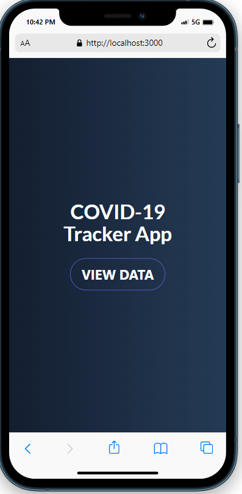
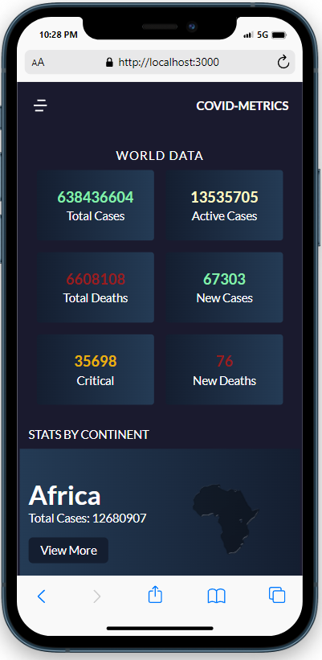

<a name="readme-top"></a>


# 📗 Table of Contents

- [📖 About the Project](#about-project)
  - [🛠 Built With](#built-with)
    - [Tech Stack](#tech-stack)
    - [Key Features](#key-features)
  - [🚀 Live Demo](#live-demo)
- [💻 Getting Started](#getting-started)
  - [Setup](#setup)
  - [Prerequisites](#prerequisites)
  - [Install](#install)
  - [Usage](#usage)
  - [Run tests](#run-tests)
  - [Deployment](#triangular_flag_on_post-deployment)
- [👥 Authors](#authors)
- [🔭 Future Features](#future-features)
- [🤝 Contributing](#contributing)
- [⭐️ Show your support](#support)
- [🙏 Acknowledgements](#acknowledgements)
- [❓ FAQ](#faq)
- [📝 License](#license)

# 📖 [COVID-19_Tracker] <a name="about-project"></a>

**COVID-19_Tracker** is a web app that tracks COVID-19 cases worldwide. It uses the VACCOVID API from RapidAPI

## 📷 [Screenshots]

<div>
  
  
</div>

## 🛠 Built With <a name="built-with"></a>

### Tech Stack <a name="tech-stack"></a>

<details>
  <summary>Client</summary>
  <ul>
    <li><a href="https://reactjs.org/">React.js</a></li>
    <li><a href="https://redux.js.org/">Redux</a></li>
    <li><a href="https://tailwindcss.com/">Tailwindcss</a></li>
    <li><a href="https://axios-http.com/docs/intro">Axios</a></li>
  </ul>
</details>

### Key Features <a name="key-features"></a>

- **[Homepage - Dispalys total data across the world]**
- **[Categories - Displays data for each continent]**
- **[Details - Displays total data for each continent]**

<p align="right">(<a href="#readme-top">back to top</a>)</p>

## 🚀 Live Demo <a name="live-demo"></a>

- [Live Demo Link](https://covid-metrics.vercel.app/)

<p align="right">(<a href="#readme-top">back to top</a>)</p>

## 🎥 Video Presentation
- [Video](https://drive.google.com/file/d/14XLysFYdkNItHbywgQVCXVoAaoP4nb01/view?usp=sharing)

<p align="right">(<a href="#readme-top">back to top</a>)</p>

## 💻 Getting Started <a name="getting-started"></a>

To get a local copy up and running, follow these steps.

### Prerequisites

In order to run this project you need:

- Latest version of [Node](https://nodejs.org/en/) installed on the computer.
- [Git](https://git-scm.com/downloads) installed on the computer.

### Setup

Clone this repository to your desired folder:

```sh
  cd my-folder
  git clone git@github.com:myaccount/my-project.git
```

### Install

Install this project with:

```sh
  cd my-project
  npm install
```

### Usage

To run the project, execute the following command:

```sh
  npm start
```

### Run tests

To run tests, run the following command:

```sh
  npm test
```

### Deployment

You can deploy this project using:

- [Vercel](https://vercel.com/docs)

<p align="right">(<a href="#readme-top">back to top</a>)</p>

## 👥 Authors <a name="authors"></a>

👤 **Kwasi Antwi Baayeh**

- GitHub: [@githubhandle](https://github.com/Baayeh)
- Twitter: [@twitterhandle](https://twitter.com/Cest_Baayeh)
- LinkedIn: [LinkedIn](https://linkedin.com/in/kabaayeh)

<p align="right">(<a href="#readme-top">back to top</a>)</p>

## 🔭 Future Features <a name="future-features"></a>

- [ ] **[Display data for every country on Homepage]**
- [ ] **[Display data for every country in a specific continent]**

<p align="right">(<a href="#readme-top">back to top</a>)</p>

## 🤝 Contributing <a name="contributing"></a>

Contributions, issues, and feature requests are welcome!

Feel free to check the [issues page](../../issues/).

<p align="right">(<a href="#readme-top">back to top</a>)</p>

## ⭐️ Show your support <a name="support"></a>

If you like this project, give it a ⭐

<p align="right">(<a href="#readme-top">back to top</a>)</p>

## 🙏 Acknowledgments <a name="acknowledgements"></a>

I would like to thank

- [Microverse](https://www.microverse.org/)
- [Nelson Sakwa on Behance](https://www.behance.net/sakwadesignstudio)
- [VACCOVID API](https://rapidapi.com/vaccovidlive-vaccovidlive-default/api/vaccovid-coronavirus-vaccine-and-treatment-tracker)

<p align="right">(<a href="#readme-top">back to top</a>)</p>

## 📝 License <a name="license"></a>

This project is [MIT](./LICENSE) licensed.

<p align="right">(<a href="#readme-top">back to top</a>)</p>
